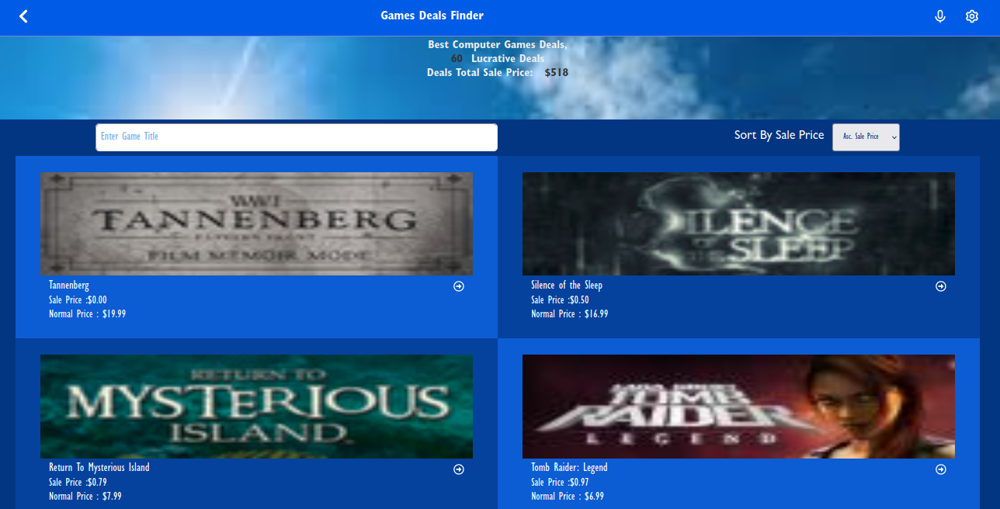
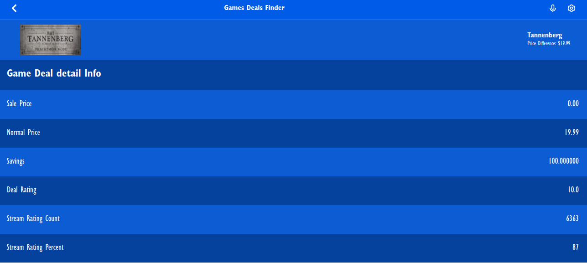

# Game-Dealer

> A website that allows users to check the available deals of computer games with data being collected directly from the cheapshark API. The app display deals of games on the home page and the details of the game deal on detail page.

## Built With:

- React & Redux
- React testing Library
- JavaScript

## Screenshot

**\* Desktop home screenshot !**

**\* mobile detail screenshot !**

## [live Demo](https://precious-crumble-81970c.netlify.app/)

## Getting Started:

To access and change the code on your computer (using GIT):

> Note: if you don't use git, you can download the ZIP of this repository by clicking on the "Code" button above the files list.

### Setup

- Open the repository [link](https://github.com/worashf/game-dealer).
- Click on the "Code" button, above the files list.
- Select one of the three options to copy the URL: HTTPS, SSH key and GitHub CLI.
- Open the Terminal in the directory you want to copy the project.
- Type git clone, paste the URL you copied, and press enter.

### Usage

To edit this project:

- Open the repository you cloned with a code editor that you like.
- Edit the code as you want.

## Authors

👤 **Worash Abocherugn**

- GitHub: [@githubhandle](https://github.com/worashf)
- Twitter: [@twitterhandle](https://twitter.com/WorashAboche)
- LinkedIn: [LinkedIn](https://www.linkedin.com/in/worash-abocherugn-a02219154/)

## Show your support

Give a star if you like my project!

### Acknowledgments

    Design is inspired from a design made by Nelson Sakwa.
    Linters are made by Microverse Inc.

## :pencil: License

This project is [MIT](https://github.com/worashf/game-dealer/blob/feature/LICENSE) licensed.
